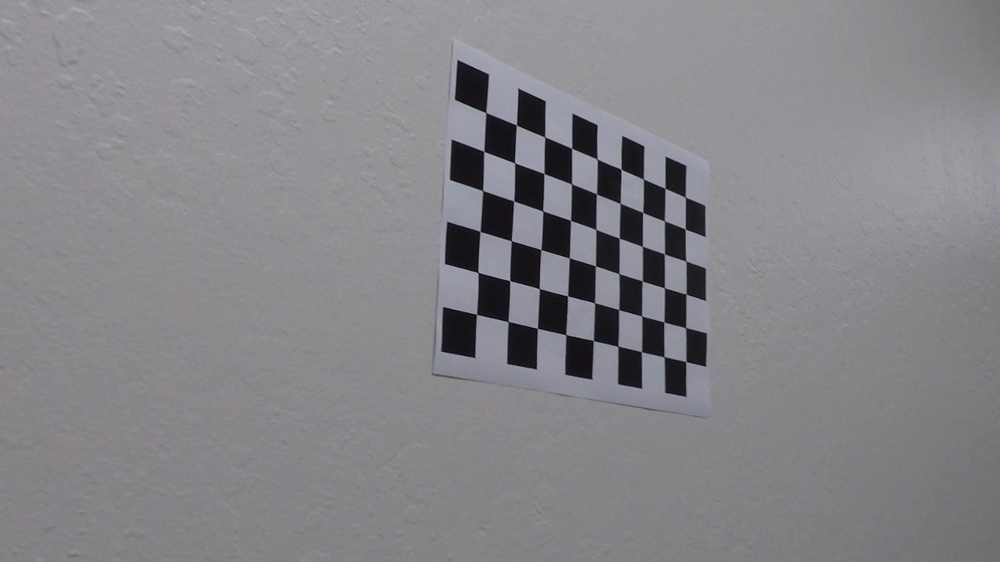
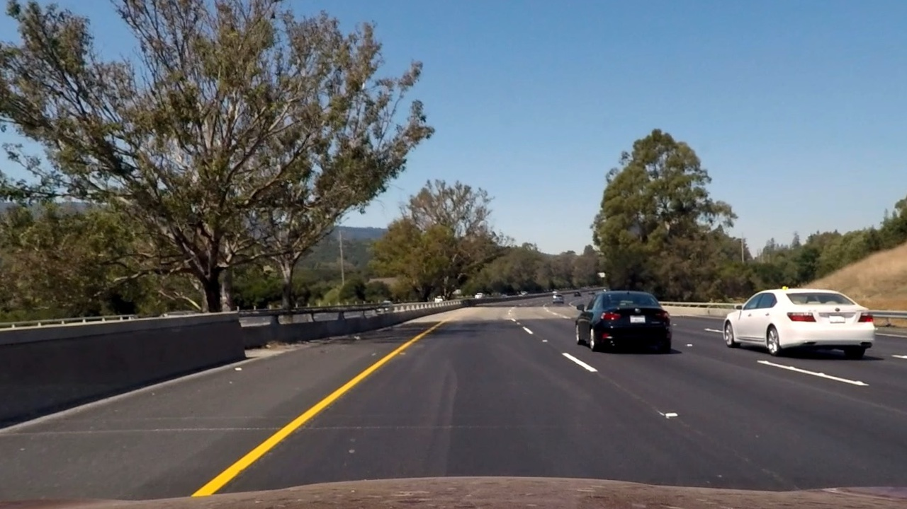
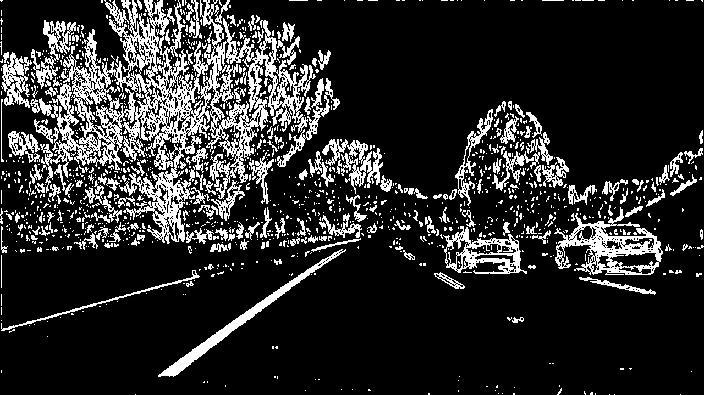
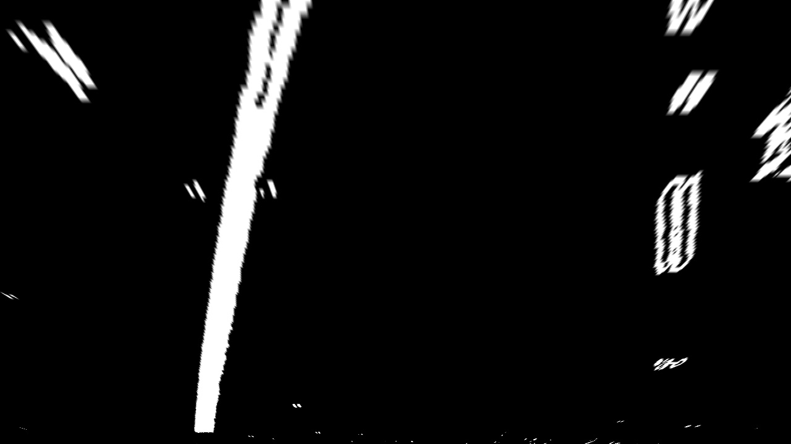
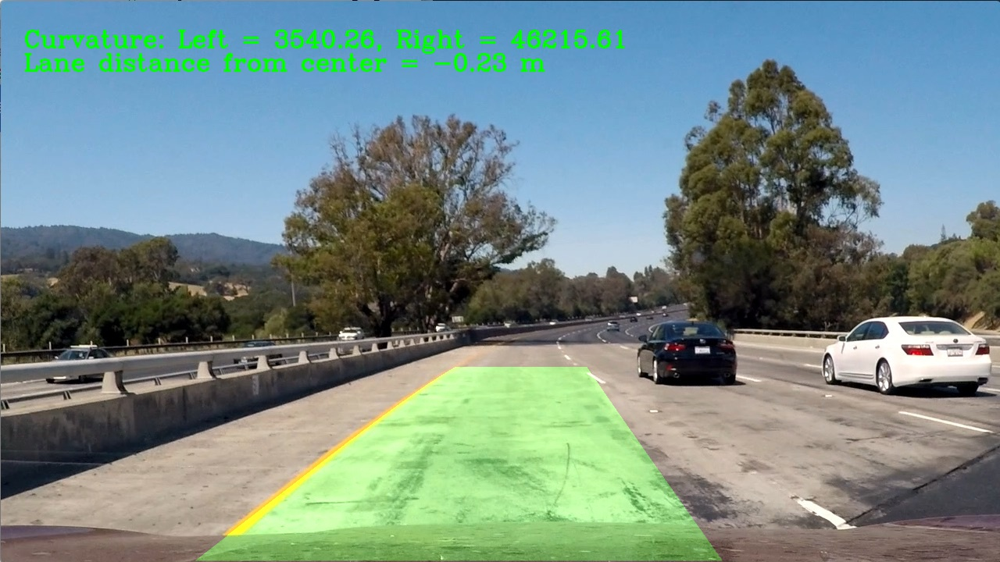
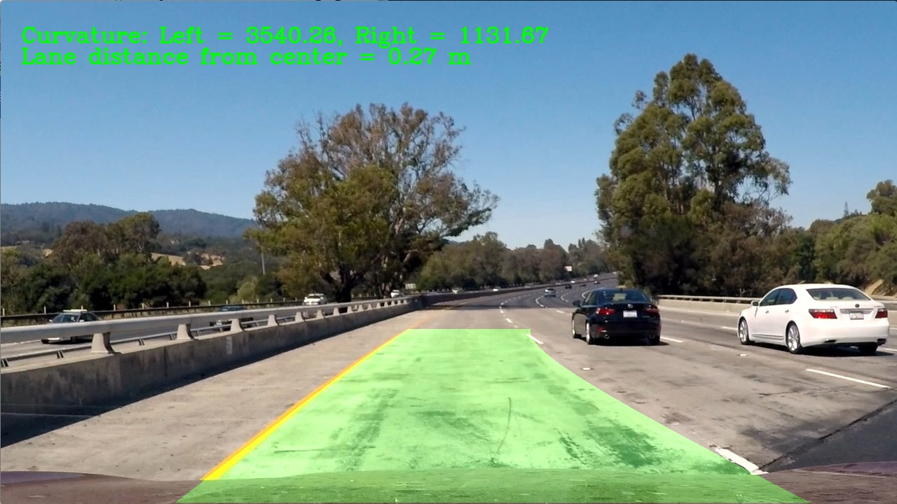

## Advanced Lane Finding

### The goal for this project was to create a pipeline of image processing procedures that would identify and mark the car lanes on the images of the road. This pipeline then should be applicable as a processing tool that can be applied to a sequence of frames from a given video.
---

The steps of this project are the following:

* Compute the camera calibration matrix and distortion coefficients given a set of chessboard images.
* Apply a distortion correction to raw images.
* Use color transforms, gradients, etc., to create a thresholded binary image.
* Apply a perspective transform to rectify binary image ("birds-eye view").
* Detect lane pixels and fit to find the lane boundary.
* Determine the curvature of the lane and vehicle position with respect to center.
* Warp the detected lane boundaries back onto the original image.
* Output visual display of the lane boundaries and numerical estimation of lane curvature and vehicle position.

## Camera Calibration

The code for this step is contained in the cell marked as Step 1.
The same code was used that was used in the Lesson's quiz.

From all provided checkerboard images in folder ./camer_cal the objpoints and the imgpoints arrays were constructed and the the CV2's method 
`cv2.calibrateCamera()` function was used. To construct the imgpoints I used the CV2'a findChessboardCorners() method

The resulting distortion matrix and camera matrix were stored in the  pickle file for use in subsequent cells.

Here are some examples:

## Pipeline (single images)

The Step 2 cell of my notebook contains filtering methods that were combined together in the method

color_gradient_combined()

From the Lessons and the quizes it was clear that on the given test images the combination of the S channel color filtering and Sobel gradient transform in the 'x' direction gives a very good result where the lines ae clearly emphasized.

The Step 3 cell of my notebook goes through each of the test images and applies 

- undistort transform given the camera calibration matrixes found in Step1
- filtering of the image to emphasize the line
- warping of the filtered image to create a birds-eye view 

The last step for warping  required identifying the trapezoid region of the image that  specificlaly contains the lines and not much else. 
I used these matrices that gave  good result. On all output images the lines look parallel -- which is what we are going for on the birds-eye view

    src = np.float32(
                    [[  100.,   719.],
                      [  542.,   470.],
                      [  738.,   470.],
                      [ 1180.,   719.]])
    
    dst = np.float32(
                    [[ 200.,  720.],
                      [ 200.,    0.],
                      [ 1080.,    0.],
                      [ 1080.,  720.]])
                      
 Example image transform of a single image:
 

 
## Fitting the lines

In the cell  Step 4 the method fit_polynomial()  uses initial histogram and a sliding window technique to identify the line pixels and then fits  a second  degree polynomial for both the left and the right lines.
There is also draw_lanes() mehtod and the get_curvature() methods defined there.
The draw_lanes() just fills a nice shape between the two lines fit by find_lane_pixels()

## Defining full pipeline

Step 5 was to define  a method process_image() that combines all the previous transformations to produce  an original image overlayed with a  nicely defined area between the dscoverd lane lines.

##  Define an efficient pipepline

In Step 6  I defined a Pipeline class  to save polynomial coefficients to be used a starting points  for each new frame image.
Also some  sanity check is performed to see if lines in the next image are reasonable and if not to fall back on the lines from the previous frame image

## Pipeline (video)

The final output from the transformation applied to the vidio project_video.mp4 is here:

---

## Discussion

The Pipeline's process_image() works really well on the `project_video.mp4`.
It does not work well on the `challenge_video.mp4` and I did spend some time analyzing the root cause.
It is clear that the lane detection procedure gets confused by the lines created by the shadow from the road separator and from uneven pavement in the middle of the car lane. 
I saved few frames from the clip and applied the same filters used on the test_images and the results were clearly pointing to a problem. There were usually more than 2 lines.  
I could not figure out the filtering technique that would help. Would be curious to know how this is avoided in real applications.

